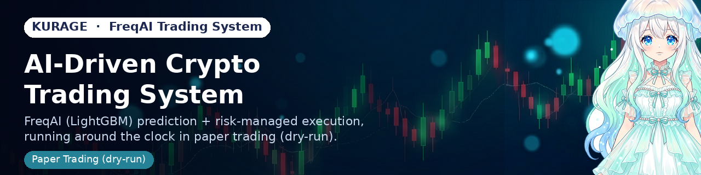

# 

[](LICENSE)
[-2582A0)](https://kurage.exbridge.jp/blog/)

**kfreqai** is an AI-driven crypto trading system built on top of [FreqAI](https://www.freqtrade.io/en/stable/freqai/) (LightGBM). It layers its own risk-management logic — overheat filters, per-pair bans, volatility-scaled position sizing, and regime-aware slot capping — on top of FreqAI's price prediction engine.

**This system currently runs in paper trading (dry-run) only. No real funds are traded.**

Progress notes, incidents, and validation results are published on the [trading blog](https://kurage.exbridge.jp/blog/) (Japanese). A live dashboard is available via [kurage_web](https://github.com/katsushi2441/kurage_web)'s `kfreqai.php`.

## How it thinks — and how it grows

kfreqai isn't just "train a model once and run it forever." Four loops run continuously, each with a different job:

- **Prediction** — FreqAI (LightGBM) predicts short-term price movement per pair on every candle, using its own technical indicators plus correlation features against BTC/ETH for market-wide context.
- **Regime awareness** — an hourly LLM pass (local Ollama) classifies the current market regime and adjusts how many concurrent positions the strategy is allowed to hold.
- **Risk directive** — three times a day, an LLM reviews recent regime calls and price action and sets a coarse risk stance (risk-on / risk-off / neutral) that the live strategy reads before sizing new entries.
- **Postmortem & research** — every closed trade is reviewed hourly by an LLM against its real entry/exit context (pre-entry move, max adverse/favorable excursion, exit reason — all computed in code; the LLM only interprets, never invents numbers) and journaled as a one-line lesson. Once a day, a separate LLM research pass reads a week of those lessons plus real performance stats and proposes up to two testable hypotheses in a constrained DSL — not free-form code generation. Each hypothesis is auto-converted into a backtestable strategy variant and judged mechanically: backtested against the current baseline over the same window, across ~160 pairs. Only hypotheses that improve P&L without meaningfully worsening drawdown become adoption candidates — a human still reviews and merges them into the live strategy. Every attempt, accepted or rejected, is recorded in `user_data/lab/hypothesis_ledger.jsonl`.

In short: the system doesn't just execute trades — it accumulates evidence about its own mistakes, has an LLM propose fixes, and holds every proposal to the same mechanical backtest bar before it's allowed anywhere near live trading.

## Architecture

Upstream freqtrade lives under `vendor/freqtrade` as a git submodule (reference only). **At runtime, `docker-compose.yml` uses the official `freqtradeorg/freqtrade:stable_freqai` image**, so nothing under `vendor/freqtrade` is ever mounted into the container. Only `user_data/` is read and written.

```
user_data/
  strategies/
    kurage_freqai_strategy.py   # live strategy (FreqAI features, entry/exit, protections)
    kfreqai_variant_*.py        # experimental variants (accept/reject decisions logged in hypothesis_ledger.jsonl)
  lab/
    hypothesis_ledger.jsonl     # ledger of tested hypotheses (decision + rationale)
    trade_journal.jsonl         # trade retrospective log
  config.json                  # live config (gitignored, contains secrets)
  config_experiment*.json      # backtest configs (30-day / 6-month holdout)

kurage-advisory/                # LLM retrospective / market-regime / news-monitoring loop (systemd timers)
kurage-growth/                  # pair-expansion and volume research scripts
kurage-scripts/                 # backtest / deploy helper scripts
kurage-systemd/                 # systemd unit/timer definitions for the above
blog-bludit/                    # trading blog (Bludit) publishing
landing/                        # kfreqai.exbridge.jp static promo page
vendor/freqtrade/               # upstream freqtrade (submodule, reference only)
```

## Running it

```bash
docker compose up -d          # start live (dry-run)
docker compose logs -f freqtrade
```

The `--strategy` / `--freqaimodel` flags in `docker-compose.yml` decide which strategy and model actually run. Switching either requires recreating the container (`docker compose up -d`; a `reload_config` alone does not pick this up).

## Backtesting

The standard validation is two windows — "30 days / 160 pairs" and "6-month holdout / 17 pairs" — and a change is only adopted if it doesn't regress either.

```bash
docker compose run --rm freqtrade backtesting \
  --config user_data/config_experiment160.json \
  --strategy <StrategyName> --freqaimodel <ModelName> \
  --enable-protections --timerange 20260610-20260709
```

Results are appended to `user_data/lab/hypothesis_ledger.jsonl`; only adopted changes are merged into the live strategy.

## Reading upstream freqtrade

```bash
git submodule update --init vendor/freqtrade
```

Use this when you need to search freqtrade's source or check API behavior. It tracks the `stable` branch as-is — kfreqai carries no local modifications to it.
